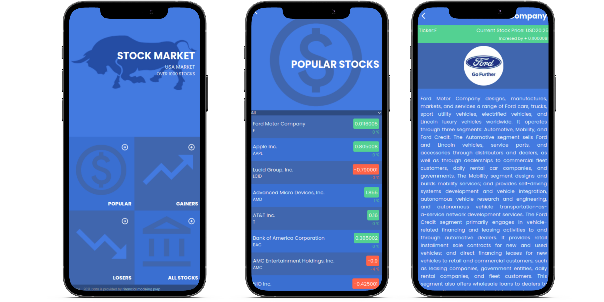

# React / Redux - Capstone: Stock Market App

> This app provides information about U.S stock market.

Stock Market is designed to allow clients to get the latest and the all essential information about the stocks (up to 1000) that are traded in the US stock market. The app allows users to select the stocks by categories and filter the stocks by different parameters as well as to search for specific stock using the search bar by ticker or company name. All data is fetched from [FMP](https://site.financialmodelingprep.com/developer/docs)

## Built With

- Major languages: JavaScript, HTML & CSS;
- Frameworks: React / Redux
- Technologies used: GitFlow, GitHub, Terminal

## Live Demo

[Live Demo](https://s-travelers-hub.netlify.app/)

## Getting Started

To get a local copy up and running follow these simple example steps.

### Prerequisites

Install or update on your local terminal the node.js package.

### Setup

To get a local copy up and running follow these simple steps.

To setup the Stock Market project in your local, in the repo page:
click on code (dropdown list) > Download as ZIP;
or open terminal of path you want to install project and run this command  
`git@github.com:Hope1226/stock-market-app.git`

### Install

Run in your terminal the following commands:

**`$ cd stock-market-app/`** 
**`$ npm install`** 
**`$ npm run build`** 
**`$ npm start`** 
**`$ npm run test`**

## Authors

👤 **Umidjon Ustabaev (Hope)**

- GitHub: [@Hope1226](https://github.com/Hope1226)
- Twitter: [@twitterhandle](https://twitter.com/twitterhandle)
- LinkedIn: [LinkedIn](https://linkedin.com/in/linkedinhandle)

## 🤝 Contributing

Contributions, issues, and feature requests are welcome!

Feel free to check the [issues page](https://github.com/Hope1226/stock-market-app/issues).

## Show your support

Give a ⭐️ if you like this project!

## Acknowledgments

This is a project done during CAPSTONE project within React / Redux Module at **[Microverse](https://www.microverse.org/)**, a remote web-developer school, using their support and frameworks provided. 
For this website, we used the [FMP](https://site.financialmodelingprep.com/developer/docs). Original design idea by [Nelson Sakwa](https://www.behance.net/sakwadesignstudio)

## 📝 License

This project is [MIT](./MIT.md) licensed.